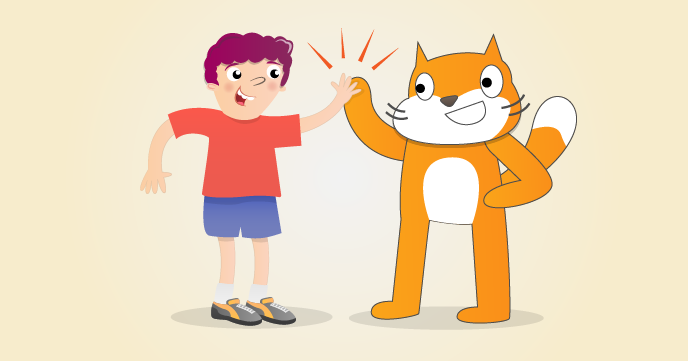

# Getting started with Scratch

Getting started with Scratch on Raspberry Pi

Scratch is a visual programming tool which allows the user to create animations and games with a drag-and-drop interface. It allows you to create your own computer games, interactive stories, and animations using some programming techniques without actually having to write code. It’s a great way to get started programming on the Raspberry Pi with young people. To find out more about Scratch, visit the website at [scratch.mit.edu](http://scratch.mit.edu) or see the [Computing At School Raspberry Pi Education Manual](http://pi.cs.man.ac.uk/download/Raspberry_Pi_Education_Manual.pdf).

## The Worksheet

- [The Worksheet](worksheet.md)

## Licence

Unless otherwise specified, everything in this repository is covered by the following licence:

***Getting Started with Scratch*** by the [Raspberry Pi Foundation](http://www.raspberrypi.org) is licenced under a [Creative Commons Attribution 4.0 International License](http://creativecommons.org/licenses/by-sa/4.0/).

Based on a work at https://github.com/raspberrypilearning/getting-started-with-scratch
